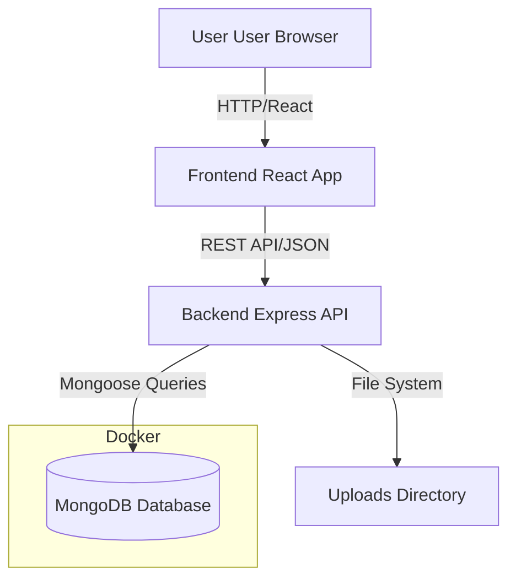

# System Architecture - SkyMemories

## Overview
SkyMemories is a modern web application built using the MERN stack (MongoDB, Express.js, React.js, Node.js), designed to be scalable and easy to deploy using Docker.

## Components

### 1. Frontend (Client)
- **Technology**: React.js (v18+)
- **UI Framework**: Bootstrap 5
- **Maps**: React-Leaflet (OpenStreetMap)
- **State Management**: React Context API or Hooks
- **Communication**: Axios for REST API consumption
- **Responsibility**: 
  - User Interface for logging in, viewing flights, and adding records.
  - Visualization of flight paths on a world map.

### 2. Backend (Server)
- **Technology**: Node.js with Express.js
- **Middleware**: 
  - `cors` for Cross-Origin Resource Sharing
  - `multer` for handling file uploads (images)
  - `dotenv` for environment variable management
  - `jsonwebtoken` (JWT) for authentication
- **Responsibility**:
  - API endpoints for business logic.
  - Authentication and Authorization.
  - File management for uploaded photos.

### 3. Database
- **Technology**: MongoDB
- **Deployment**: Docker Container
- **Responsibility**:
  - Persistent storage of user data and flight records.
  - Flexible schema for evolving flight data (e.g., optional notes, variable photo counts).

### 4. Infrastructure
- **Docker**: Containerization of the database (and optionally the app services).
- **Docker Compose**: Orchestration of the MongoDB service.

## Architecture Diagram

