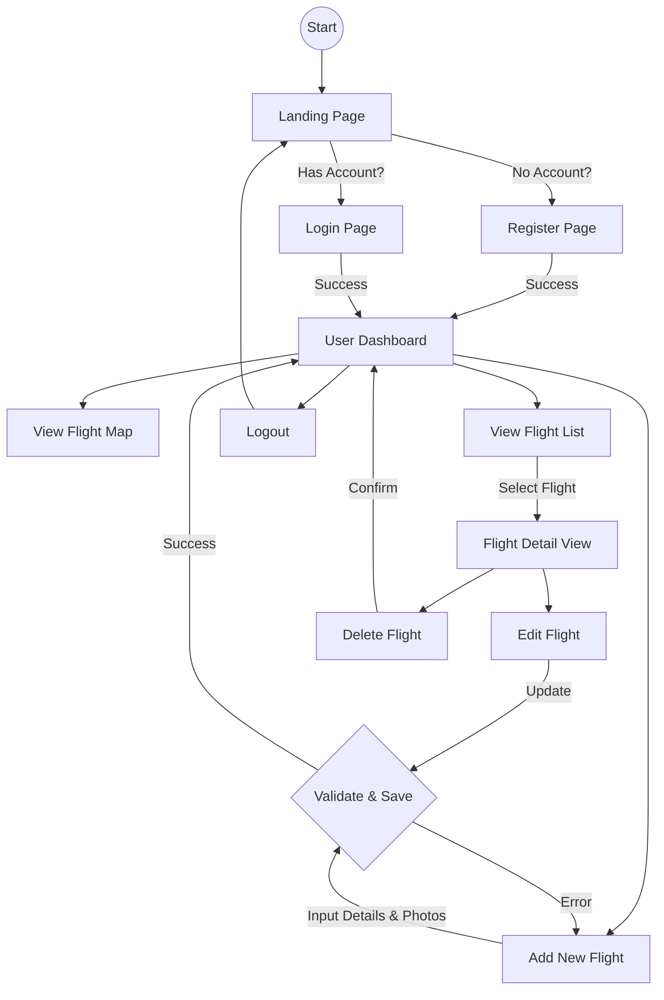

# System Flowchart - SkyMemories

This document outlines the user interaction flows within the SkyMemories application.

## User Journey

## Data Flow (Add Flight)

1. **User** fills out the flight form (Airline, Date, Route, etc.) and selects photos.
2. **Frontend** sends a `POST /api/upload` request for each photo to get server paths.
3. **Frontend** collects form data + photo paths and sends `POST /api/flights`.
4. **Backend** validates the token and data.
5. **Backend** saves the record to **MongoDB**.
6. **Backend** returns the created object to **Frontend**.
7. **Frontend** updates the state/UI to show the new flight.
